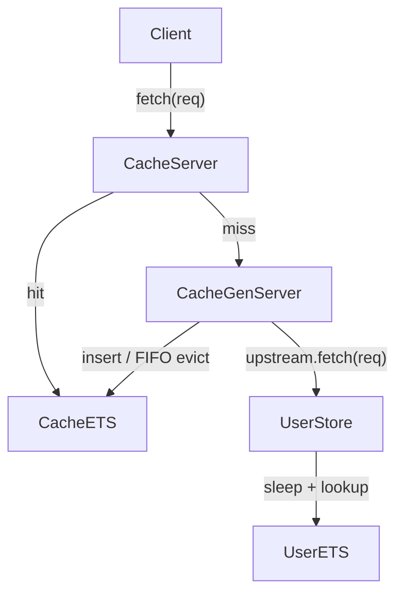
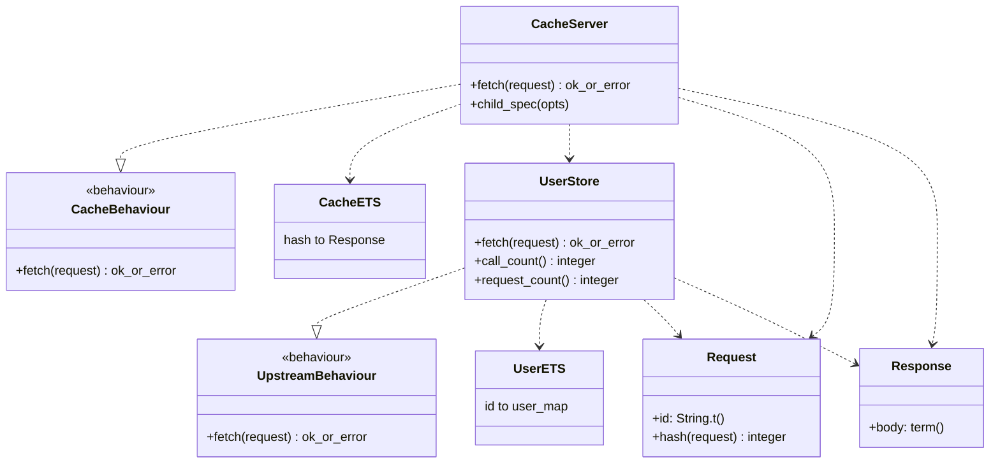

# Architecture

## Data flow (V1)

## Module diagram (V1)

## V1 design notes

### Request key vs hash

The logical cache key is the **request struct**. `Request.hash/1` provides an
integer storage key in cache ETS (`{hash, %Response{}}`).

### FIFO eviction

`Cache.Server` keeps a FIFO `queue` of hashes in GenServer state (insertion order).
On cache **hit**, the queue is **not** reordered. When capacity is exceeded, the
oldest hash in the queue is removed from both the queue and cache ETS.

### Concurrency

- **Hits:** `fetch/1` reads cache ETS directly (`read_concurrency: true`).
- **Misses:** coordinated through the GenServer (upstream call, insert, eviction).

### Error handling

Both cache and upstream return `{:ok, %Response{}}` or `{:error, term()}`.
Upstream `{:error, :not_found}` responses are **not** cached.

`UserStore.call_count/0` counts successful upstream lookups.
`UserStore.request_count/0` counts all upstream fetch attempts (used to verify
errors are not cached).

## How to read the diagram

- **Cache.Server** — V1 FIFO cache implementation.
- **UserStore** — simulated slow user DB (ETS + sleep), seeds `users/1`–`users/10`.
- **Cache ETS** — cached responses keyed by `Request.hash/1`.
- **User ETS** — seeded upstream data keyed by request `id`.
