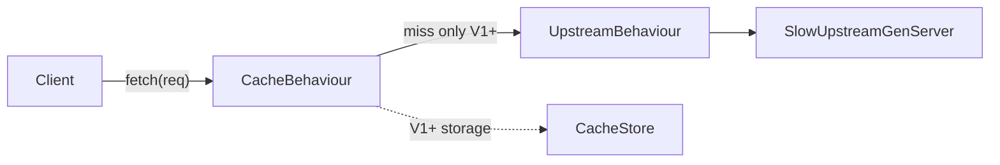
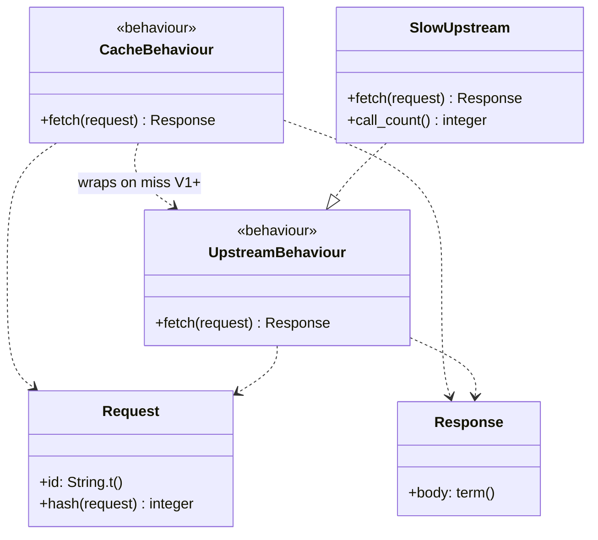

# Architecture

V0 defines the cache and upstream interfaces. Storage and eviction arrive in V1+.

## Data flow (V0)

## Module diagram (V0)

`call_count` on `SlowUpstream` is test-only: it tracks how many times the fake
upstream was called so tests can prove cache hits avoid upstream fetches.

## How to read the diagram

- **CacheBehaviour** — contract for the cache (`fetch/1`). Implemented in V1.
- **UpstreamBehaviour** — contract for the slow backend (`fetch/1`).
- **SlowUpstream** — test GenServer that sleeps and counts calls (not production).
- **Request / Response** — structs passed through both interfaces.
- Dashed **wraps on miss V1+** — cache consults upstream only when it has no valid entry.
