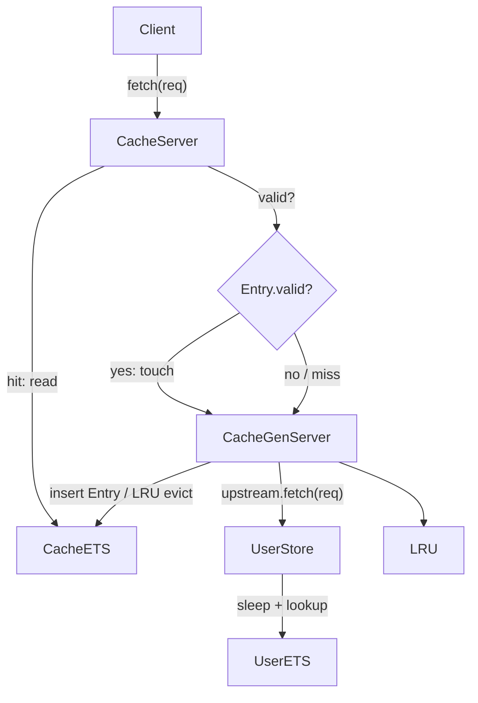
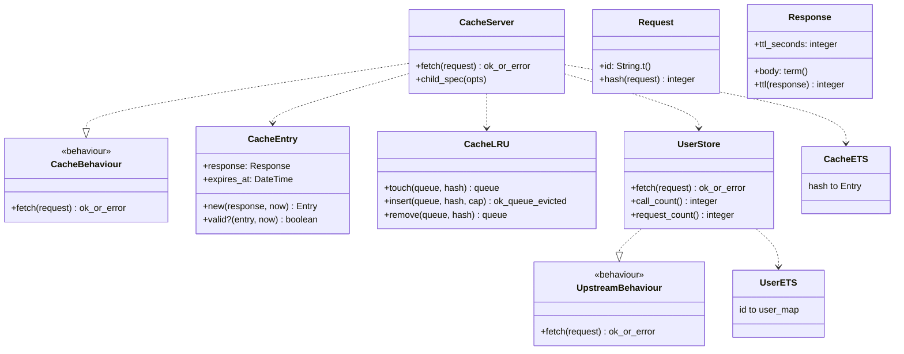

# Architecture

## Data flow (V3)

## Module diagram (V3)

## V3 design notes

### Request key vs hash

The logical cache key is the **request struct**. `Request.hash/1` provides an
integer storage key in cache ETS (`{hash, %Entry{}}`).

### Cache entries (response + metadata)

ETS stores `%AppworkCache.Cache.Entry{response, expires_at}`, not raw responses.
`expires_at` is computed at insert from `Response.ttl/1`.

### LRU eviction

`AppworkCache.Cache.LRU` maintains a queue of distinct hashes: front = LRU, back = MRU.

- On **valid hit:** ETS read, then `GenServer.call({:touch, hash})`.
- On **miss or expired:** invalidate stale key, upstream fetch, `Entry.new/2`, `LRU.insert/3`.

### TTL expiration

- **Lazy invalidation:** expired entries are removed on fetch, then treated as a miss.
- **No touch on expired entries** — upstream is consulted again.
- `Entry.valid?/2` compares `expires_at` to `DateTime.utc_now()`.

### Concurrency

- **Valid hits:** ETS read + synchronous LRU touch.
- **Misses/expired:** coordinated through the GenServer.

### Error handling

Upstream `{:error, :not_found}` responses are **not** cached.

## How to read the diagram

- **Cache.Server** — V3 LRU + TTL cache.
- **Cache.Entry** — cached value with `expires_at`.
- **Cache.LRU** — queue helpers including `remove/2` for stale keys.
- **UserStore** — per-user `ttl_seconds` in seeded data (`users/1` → 1s for tests).
