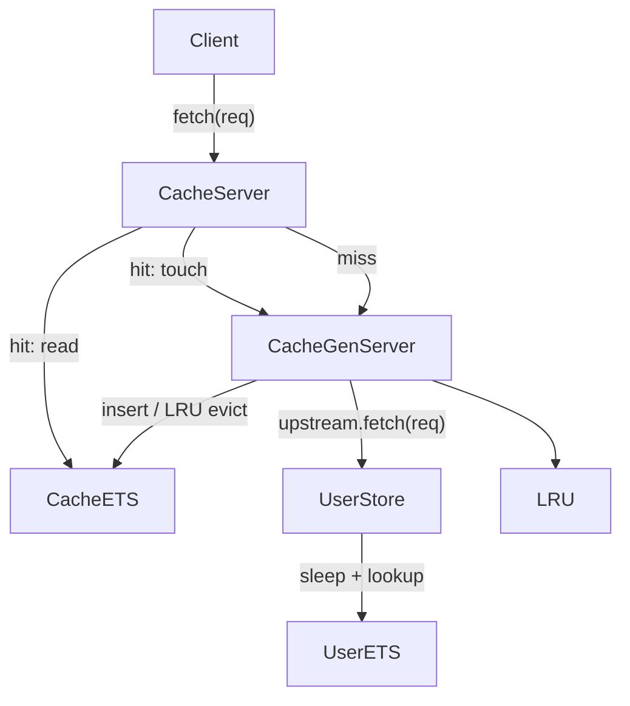
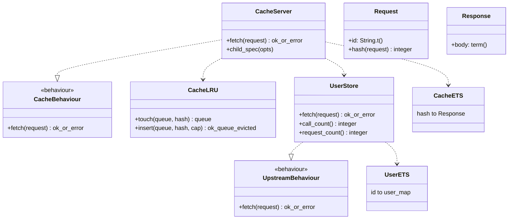

# Architecture

## Data flow (V2)

## Module diagram (V2)

## V2 design notes

### Request key vs hash

The logical cache key is the **request struct**. `Request.hash/1` provides an
integer storage key in cache ETS (`{hash, %Response{}}`).

### LRU eviction

`AppworkCache.Cache.LRU` maintains a queue of distinct hashes: front = least
recently used, back = most recently used.

- On **hit:** ETS read, then `GenServer.call({:touch, hash})` promotes the key.
- On **miss:** after upstream insert, `LRU.insert/3` promotes and evicts the
  front when `length(queue) > cap`.

`GenServer.call` (not `cast`) for touches serializes queue updates with concurrent
misses/evictions.

V1 used FIFO (insertion order, no promotion on hit). V2 replaces that with LRU.

### Concurrency

- **Hits:** `fetch/1` reads cache ETS directly, then synchronously touches LRU.
- **Misses:** coordinated through the GenServer (double-check ETS, upstream, insert, eviction).

### Error handling

Both cache and upstream return `{:ok, %Response{}}` or `{:error, term()}`.
Upstream `{:error, :not_found}` responses are **not** cached.

## How to read the diagram

- **Cache.Server** — V2 LRU cache implementation.
- **Cache.LRU** — pure queue helpers (`touch/2`, `insert/3`).
- **UserStore** — simulated slow user DB (ETS + sleep), seeds `users/1`–`users/10`.
- **Cache ETS** — cached responses keyed by `Request.hash/1`.
